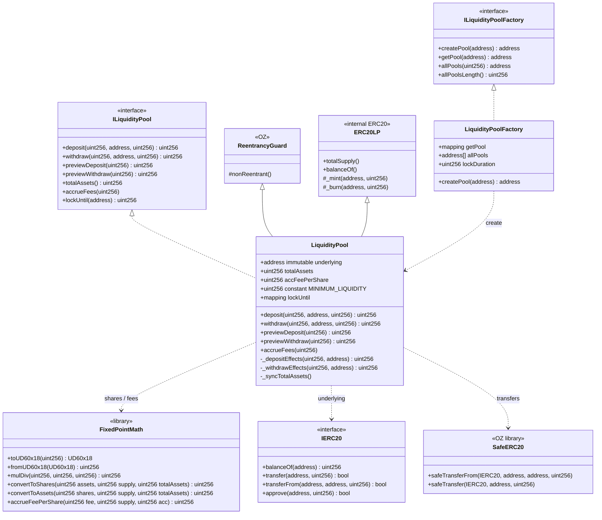
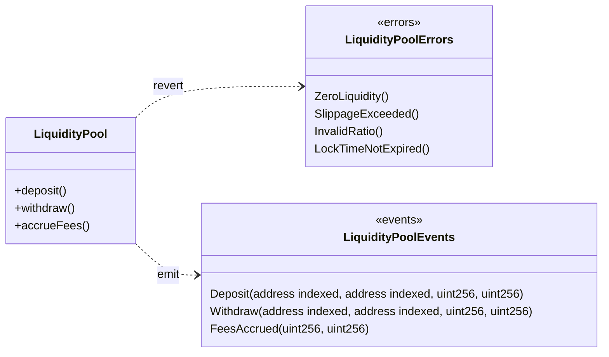
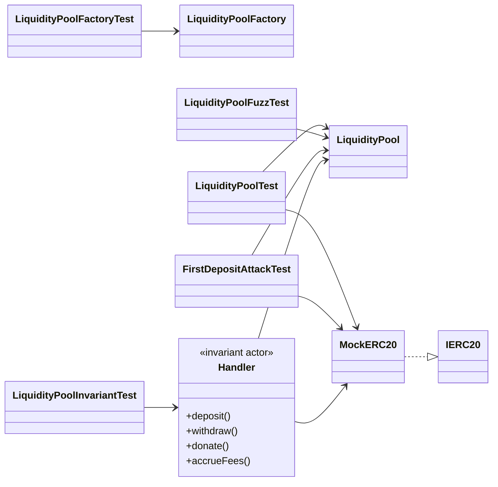
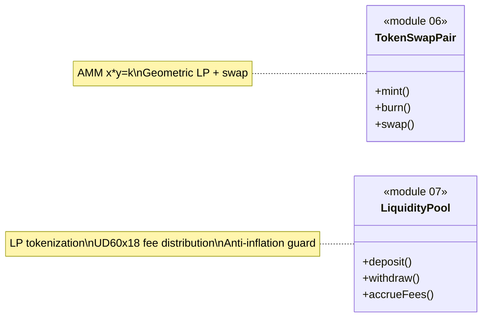

# Class Diagram — Liquidity Pools & Fee Distribution

🌐 [Español](./diagrama-clases-ES.md) · **English** · [Index](./README.md)

**To-be** structural model (module 07, planning). Contracts, libraries, and tests.

## 1. Main diagram (UML / Mermaid)



## 2. Errors and events



## 3. Tests and invariant handlers



## 4. Responsibilities

| Artifact | Role |
|----------|------|
| `LiquidityPool` | Holds the underlying, mints/burns LP, fee accrual, lock time |
| `LiquidityPoolFactory` | Creates one unique pool per underlying token |
| `FixedPointMath` | Shares ↔ assets conversion; `accFeePerShare` accumulator (UD60x18) |
| `ERC20LP` | Internal representation of pool ownership |
| `ReentrancyGuard` | Lock on deposit/withdraw |
| `SafeERC20` | Safe transfers of the underlying |
| `MockERC20` | Test token for Foundry / Anvil |
| `Handler` | Random actor for invariant testing |
| `FirstDepositAttackTest` | Verifies that donation/inflation doesn't drain LPs |

## 5. Dependencies (summary)

```
LiquidityPool
  ├── inherits   → ERC20LP (internal), ReentrancyGuard
  ├── implements → ILiquidityPool
  ├── uses       → FixedPointMath (UD60x18), SafeERC20
  ├── holds      → IERC20 underlying
  ├── emits      → Deposit / Withdraw / FeesAccrued
  └── reverts    → ZeroLiquidity / SlippageExceeded / InvalidRatio / LockTimeNotExpired

LiquidityPoolFactory
  ├── createPool → new LiquidityPool(underlying, lockDuration)
  └── getPool    → mapping underlying → pool

FixedPointMath
  ├── convertToShares(assets, supply, totalAssets)
  ├── convertToAssets(shares, supply, totalAssets)
  └── accrueFeePerShare(fee, supply, acc) → acc + fee * 1e18 / supply
```

## 6. Solidity layout (LiquidityPool)

1. Imports / interfaces / libraries  
2. Contract `LiquidityPool`  
3. Immutables (`underlying`, `lockDuration`)  
4. State: `totalAssets`, `accFeePerShare`, `lockUntil`  
5. Events → Errors → Modifiers  
6. External: `deposit`, `withdraw`, `preview*`, `totalAssets`, `accrueFees`  
7. Internal: `_depositEffects`, `_withdrawEffects`, `_syncTotalAssets`, `_mint`, `_burn`

## 7. Relationship with module 06 (Token Swap)



Module 07 abstracts **tokenization and fee distribution** as a standalone primitive; it can later be integrated with the module 06 AMM pairs.
