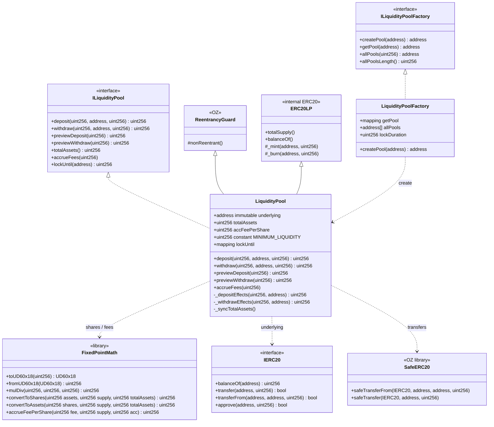
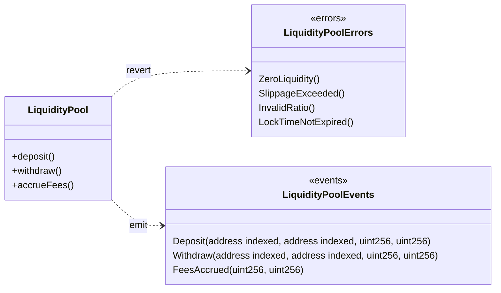
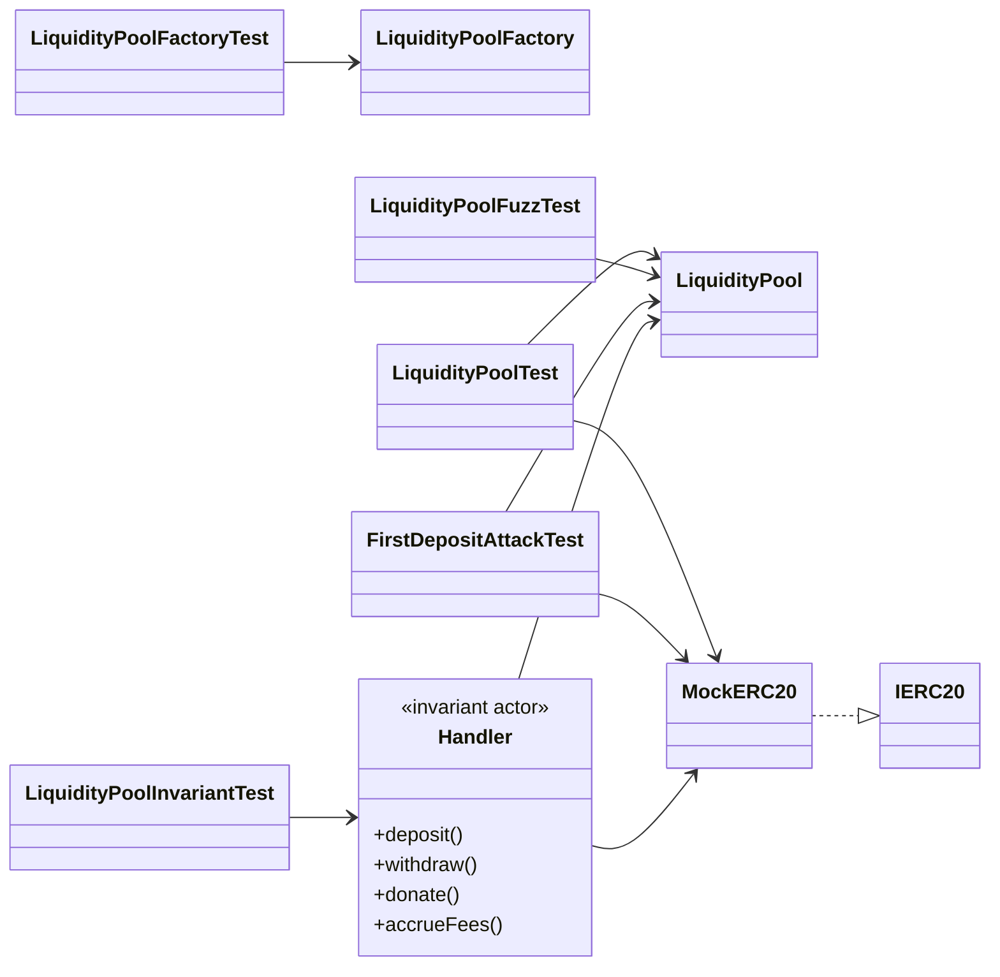
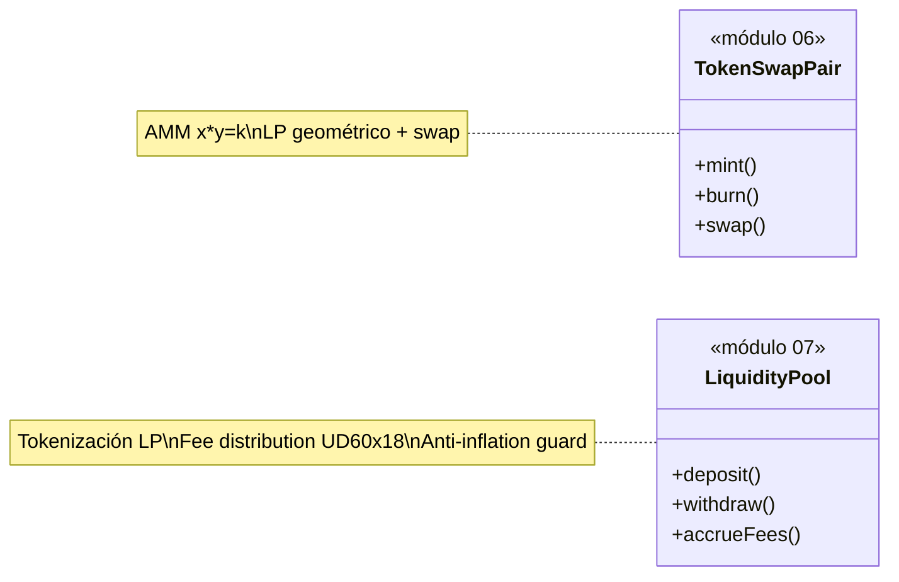

# Diagrama de clases — Liquidity Pools & Fee Distribution

🌐 **Español** · [English](./diagrama-clases-EN.md) · [Índice](./README.md)

Modelo estructural **to-be** (módulo 07, planificación). Contratos, librerías y tests.

## 1. Diagrama principal (UML / Mermaid)



## 2. Errores y eventos



## 3. Tests y handlers de invariantes



## 4. Responsabilidades

| Artefacto | Rol |
|-----------|-----|
| `LiquidityPool` | Custodia underlying, mint/burn LP, fee accrual, lock time |
| `LiquidityPoolFactory` | Crear pools únicos por token subyacente |
| `FixedPointMath` | Conversión shares ↔ assets; acumulador `accFeePerShare` (UD60x18) |
| `ERC20LP` | Representación interna de participación en el pool |
| `ReentrancyGuard` | Lock en deposit/withdraw |
| `SafeERC20` | Transferencias seguras del underlying |
| `MockERC20` | Token de prueba Foundry / Anvil |
| `Handler` | Actor aleatorio para invariant testing |
| `FirstDepositAttackTest` | Verifica que donation/inflation no drena LPs |

## 5. Dependencias (resumen)

```
LiquidityPool
  ├── hereda     → ERC20LP (interno), ReentrancyGuard
  ├── implementa → ILiquidityPool
  ├── usa        → FixedPointMath (UD60x18), SafeERC20
  ├── custodia   → IERC20 underlying
  ├── emite      → Deposit / Withdraw / FeesAccrued
  └── revierte   → ZeroLiquidity / SlippageExceeded / InvalidRatio / LockTimeNotExpired

LiquidityPoolFactory
  ├── createPool → new LiquidityPool(underlying, lockDuration)
  └── getPool    → mapping underlying → pool

FixedPointMath
  ├── convertToShares(assets, supply, totalAssets)
  ├── convertToAssets(shares, supply, totalAssets)
  └── accrueFeePerShare(fee, supply, acc) → acc + fee * 1e18 / supply
```

## 6. Layout Solidity (LiquidityPool)

1. Imports / interfaces / libraries  
2. Contract `LiquidityPool`  
3. Immutables (`underlying`, `lockDuration`)  
4. State: `totalAssets`, `accFeePerShare`, `lockUntil`  
5. Events → Errors → Modifiers  
6. External: `deposit`, `withdraw`, `preview*`, `totalAssets`, `accrueFees`  
7. Internal: `_depositEffects`, `_withdrawEffects`, `_syncTotalAssets`, `_mint`, `_burn`

## 7. Relación con módulo 06 (Token Swap)



El módulo 07 abstrae la **tokenización y distribución de fees** como primitiva independiente; puede integrarse posteriormente con pares AMM del módulo 06.
