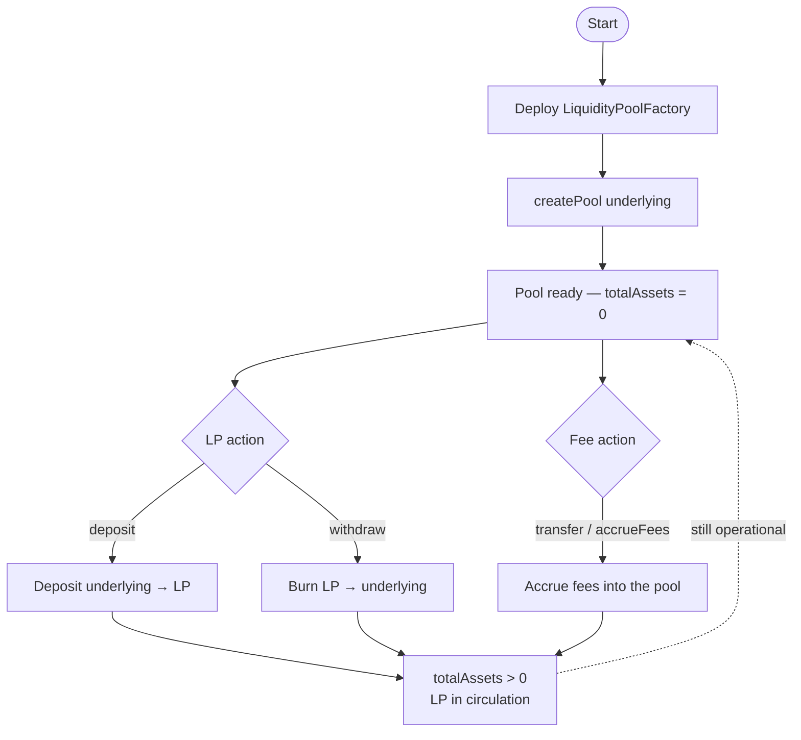
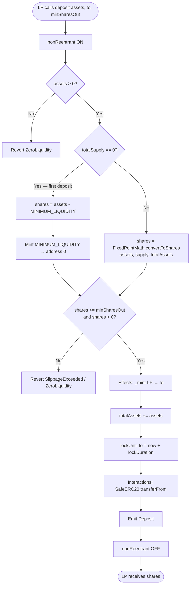
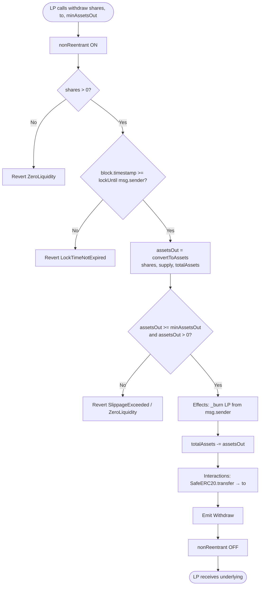
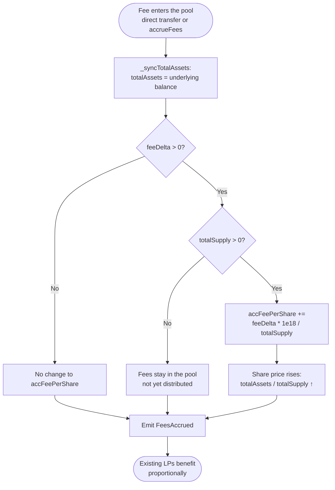
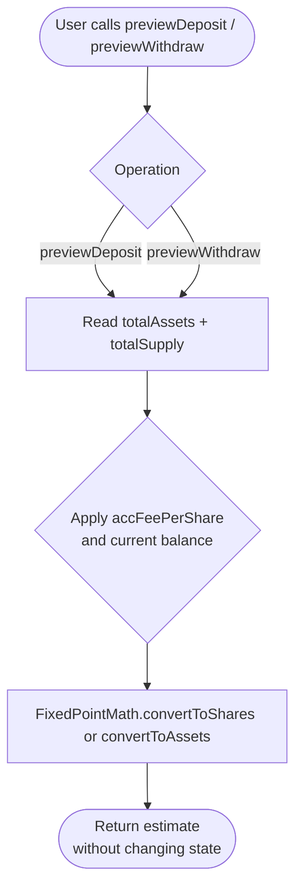
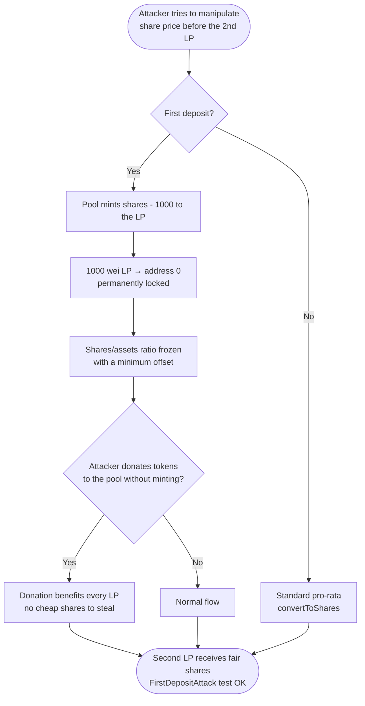

# Flow Diagram — Liquidity Pools & Fee Distribution

🌐 [Español](./diagrama-flujo-ES.md) · **English** · [Index](./README.md)

**To-be** business flows (v1). See also [flujograma-EN.md](./flujograma-EN.md) and [PLANIFICACION-EN.md](./PLANIFICACION-EN.md).

## 1. Pool lifecycle

## 2. Deposit flow (first deposit vs later deposits)

## 3. Withdraw flow

## 4. Fee accrual flow

## 5. Preview flow (view — no state change)

## 6. Anti-inflation flow (first deposit)

## Legend

| Symbol | Meaning |
|--------|---------|
| Rectangle | On-chain process / action |
| Diamond | Decision / validation |
| Oval | Start / end |
| Dotted arrow | Persistent pool state |

## CEI order (deposit / withdraw)

| Step | Deposit | Withdraw |
|------|---------|----------|
| **Checks** | assets > 0, ratio, slippage | shares > 0, lock time, slippage |
| **Effects** | `_mint`, `totalAssets +=`, `lockUntil` | `_burn`, `totalAssets -=` |
| **Interactions** | underlying `transferFrom` | underlying `transfer` |
