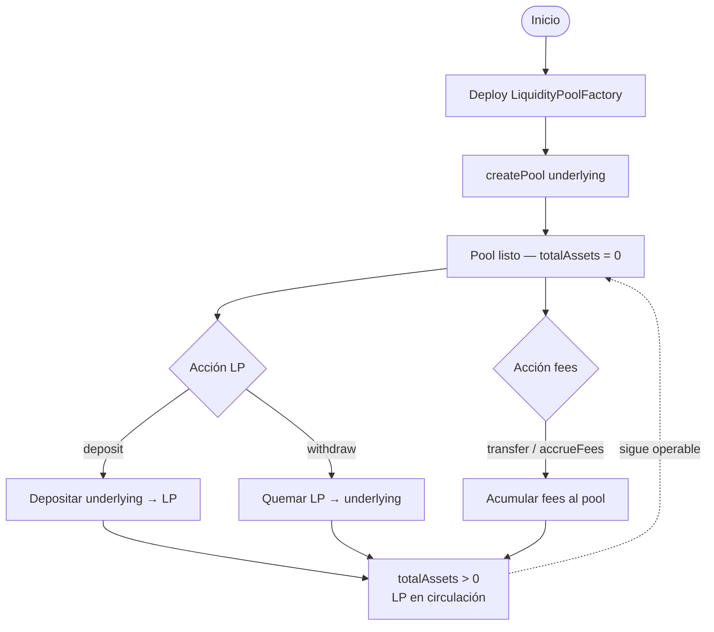
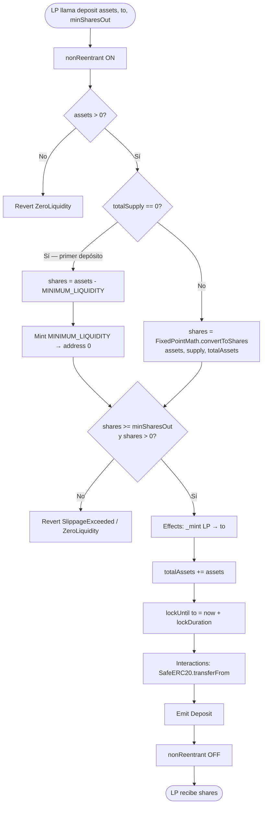
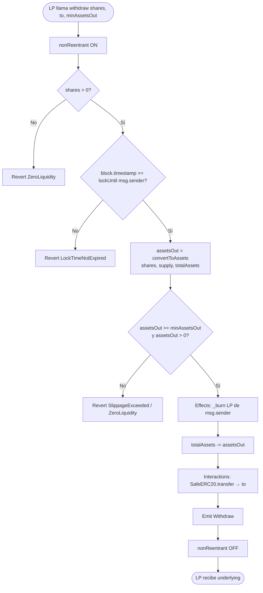
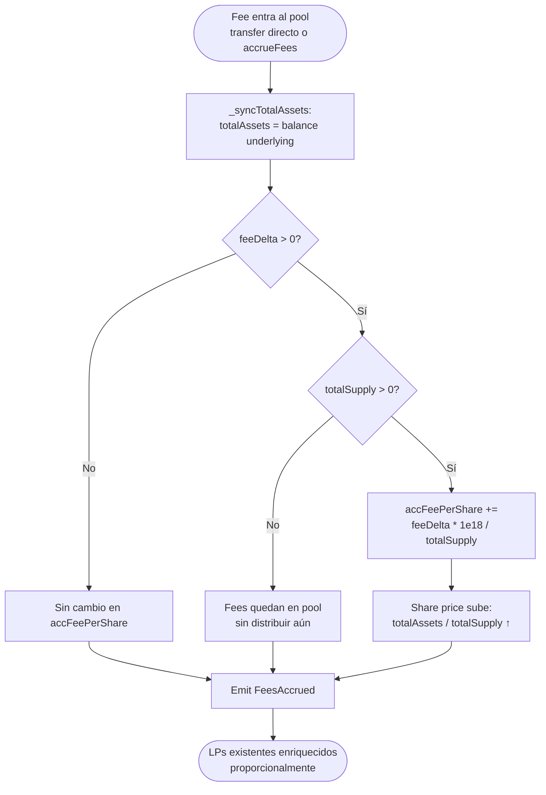
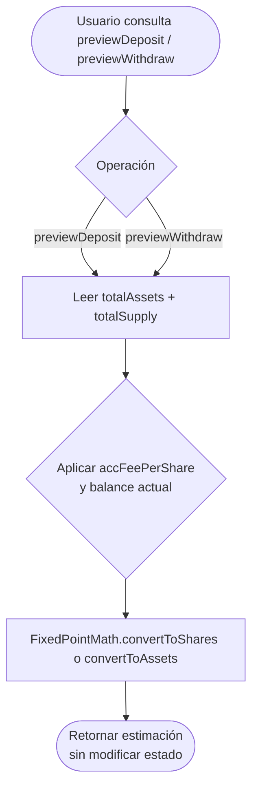
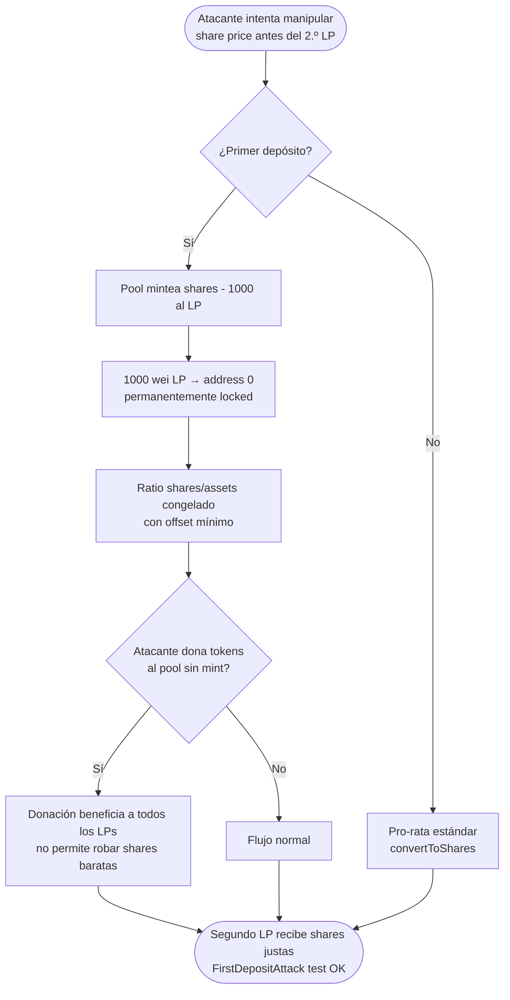

# Diagrama de flujo — Liquidity Pools & Fee Distribution

Flujos de negocio **to-be** (v1). Ver también [flujograma.md](./flujograma.md) y [PLANIFICACION.md](./PLANIFICACION.md).

## 1. Ciclo de vida del pool

## 2. Flujo de deposit (primer depósito vs subsequent)

## 3. Flujo de withdraw

## 4. Flujo de acumulación de fees

## 5. Flujo preview (view — sin estado)

## 6. Flujo anti-inflation (primer depósito)

## Leyenda

| Símbolo | Significado |
|---------|-------------|
| Rectángulo | Proceso / acción on-chain |
| Diamante | Decisión / validación |
| Óvalo | Inicio / fin |
| Flecha punteada | Estado persistente del pool |

## Orden CEI (deposit / withdraw)

| Paso | Deposit | Withdraw |
|------|---------|----------|
| **Checks** | assets > 0, ratio, slippage | shares > 0, lock time, slippage |
| **Effects** | `_mint`, `totalAssets +=`, `lockUntil` | `_burn`, `totalAssets -=` |
| **Interactions** | `transferFrom` underlying | `transfer` underlying |
