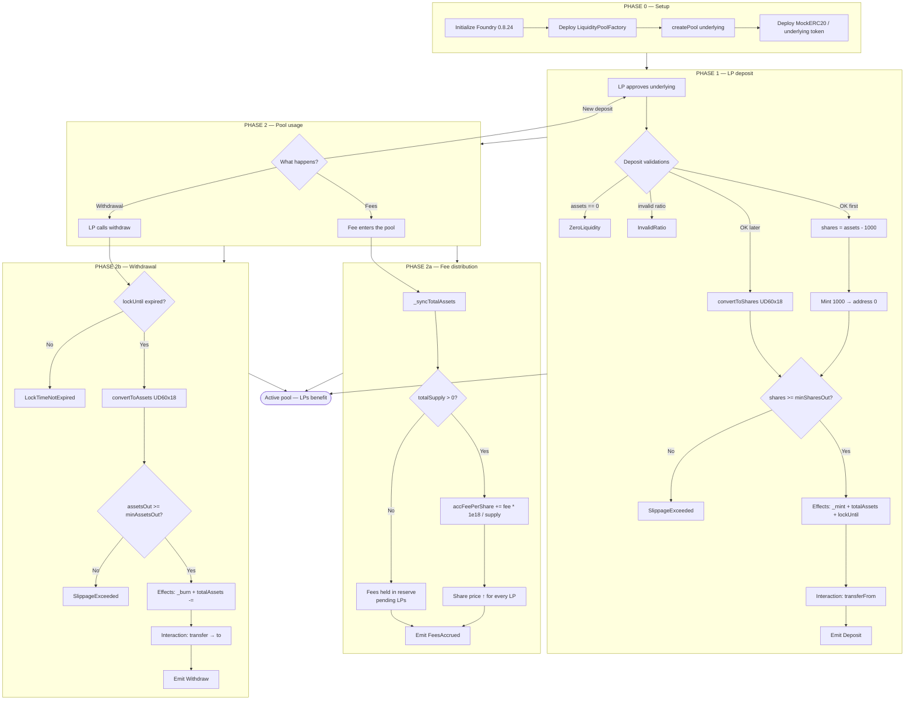
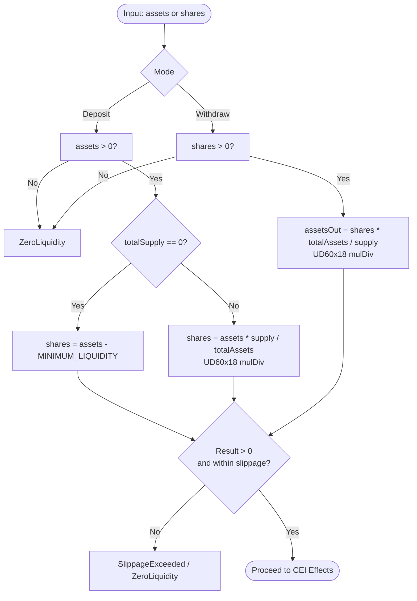
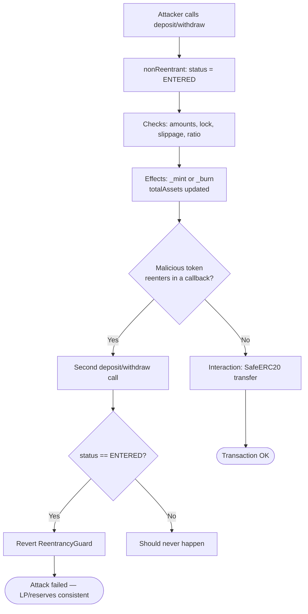
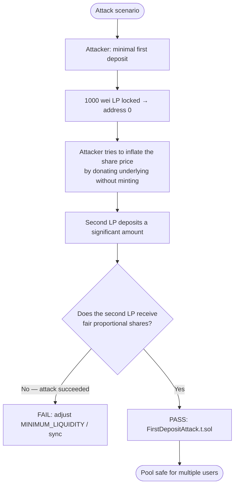
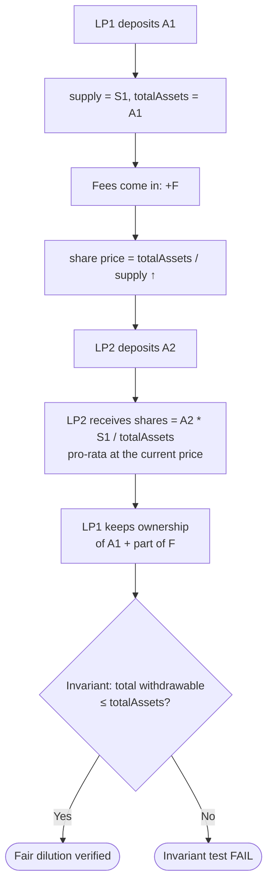

# Project Flowchart — Liquidity Pools & Fee Distribution

🌐 [Español](./flujograma-ES.md) · **English** · [Index](./README.md)

**To-be** operational flowchart (v1): setup → deposit → fees → withdrawal → security → TDD.

## 1. System master flowchart

## 2. Detailed UD60x18 flowchart (share conversion)

## 3. Security flowchart (reentrancy + CEI)

## 4. First-deposit attack flowchart

## 5. Development pipeline flowchart (TDD)

```mermaid
flowchart LR
    A[.cursorrules] --> B[Planning docs]
    B --> C[Red .t.sol tests]
    C --> D[FixedPointMath UD60x18]
    D --> E[deposit + MINIMUM_LIQUIDITY]
    E --> F[withdraw + lock time + slippage]
    F --> G[accrueFees + share price]
    G --> H[LiquidityPoolFactory]
    H --> I[Fuzz + Invariant 1000]
    I --> J[FirstDepositAttack tests]
    J --> K[Gas + NatSpec + SafeERC20]
    K --> L([Module closed])
```

## 6. Flow ↔ function ↔ invariant matrix

| Flowchart step | Function | Invariant |
|----------------|----------|-----------|
| Create pool | `Factory.createPool` | One pool per `underlying` |
| First deposit | `deposit` | `totalSupply = assets - 1000`; 1000 LP locked |
| Later deposit | `deposit` | shares ∝ `assets * supply / totalAssets` |
| Pre-withdraw | `withdraw` | `block.timestamp >= lockUntil[sender]` |
| Post-withdraw | `withdraw` | `totalAssets -= assetsOut`; supply ↓ |
| Fee accrual | `accrueFees` / sync | `accFeePerShare` ↑; share price ↑ |
| Deposit slippage | `deposit` | `shares >= minSharesOut` |
| Withdraw slippage | `withdraw` | `assetsOut >= minAssetsOut` |
| Invalid ratio | `deposit` | `InvalidRatio` if the constraint is not met |
| Invariant suite | Handler | `totalAssets >= convertToAssets(totalSupply)` |
| Reentry | guard | the second call reverts |
| First-deposit attack | test | the second LP doesn't lose more than the fuzz tolerance |

## 7. Multi-user flowchart (share dilution)

## 8. How to read these diagrams

1. **Setup → Deposit**: the pool starts empty; the first deposit sets the initial ratio with an anti-inflation offset (`1000` wei locked).
2. **Branch**: fees (benefit LPs through the share price) or withdrawal (with lock time and slippage).
3. **UD60x18**: every shares ↔ assets conversion and fee accumulation uses fixed point to avoid drift.
4. **CEI**: mint/burn always happens before transfers — critical for reentrancy.
5. **TDD pipeline**: red tests → implementation → fuzz/invariant/attack → module closed.
