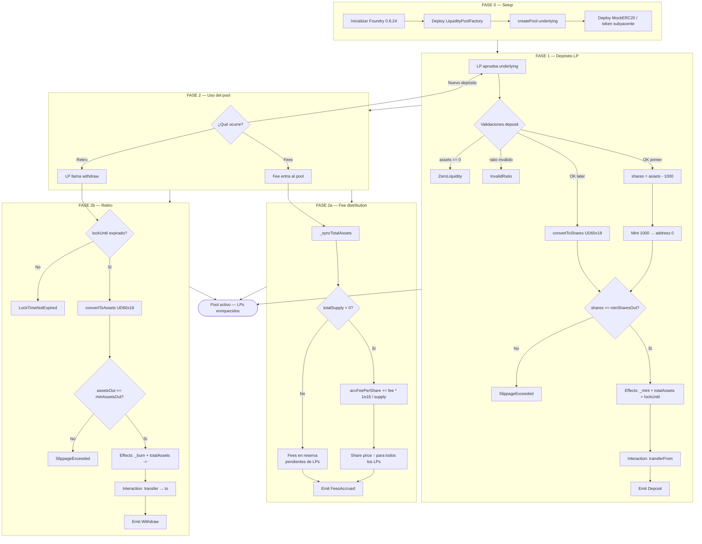
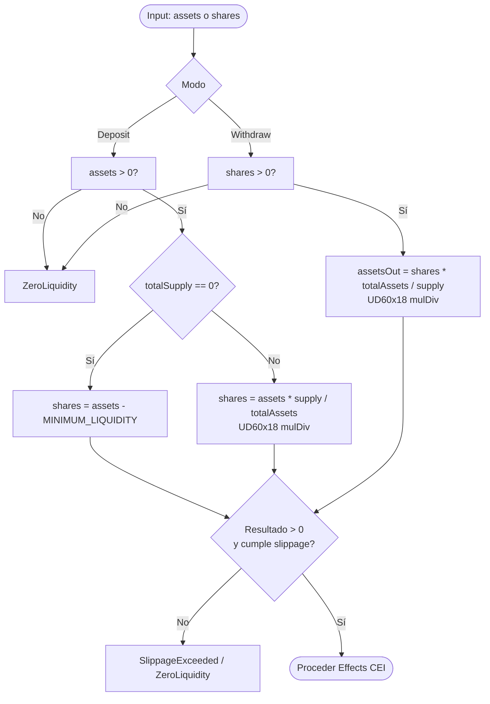
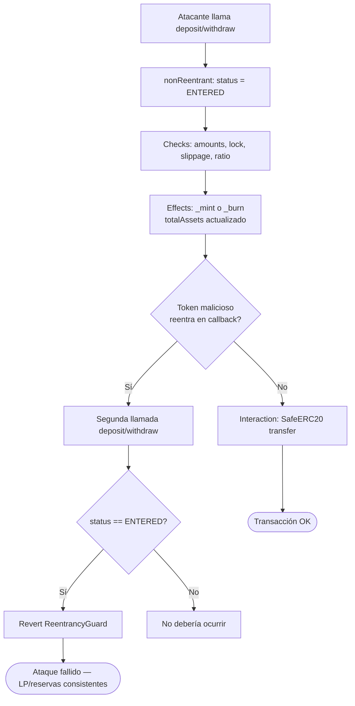
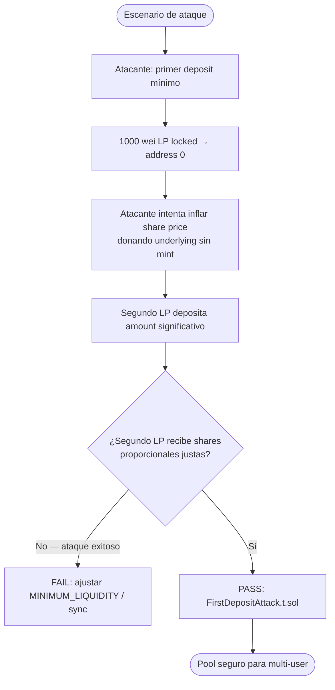
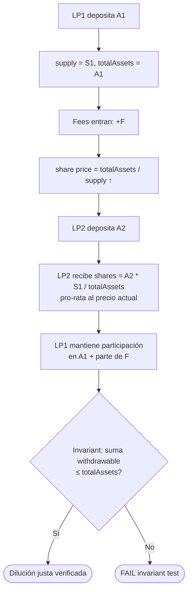

# Flujograma del proyecto — Liquidity Pools & Fee Distribution

Flujograma operativo **to-be** (v1): setup → depósito → fees → retiro → seguridad → TDD.

## 1. Flujograma maestro del sistema

## 2. Flujograma detallado UD60x18 (conversión shares)

## 3. Flujograma de seguridad (reentrancy + CEI)

## 4. Flujograma anti first-deposit attack

## 5. Flujograma del pipeline de desarrollo (TDD)

```mermaid
flowchart LR
    A[.cursorrules] --> B[Docs planificación]
    B --> C[Tests .t.sol rojos]
    C --> D[FixedPointMath UD60x18]
    D --> E[deposit + MINIMUM_LIQUIDITY]
    E --> F[withdraw + lock time + slippage]
    F --> G[accrueFees + share price]
    G --> H[LiquidityPoolFactory]
    H --> I[Fuzz + Invariant 1000]
    I --> J[FirstDepositAttack tests]
    J --> K[Gas + NatSpec + SafeERC20]
    K --> L([Módulo cerrado])
```

## 6. Matriz flujo ↔ función ↔ invariante

| Paso del flujograma | Función | Invariante |
|---------------------|---------|------------|
| Crear pool | `Factory.createPool` | Un pool por `underlying` |
| Primer deposit | `deposit` | `totalSupply = assets - 1000`; 1000 LP locked |
| Deposit posterior | `deposit` | shares ∝ `assets * supply / totalAssets` |
| Pre-withdraw | `withdraw` | `block.timestamp >= lockUntil[sender]` |
| Post-withdraw | `withdraw` | `totalAssets -= assetsOut`; supply ↓ |
| Fee accrual | `accrueFees` / sync | `accFeePerShare` ↑; share price ↑ |
| Slippage deposit | `deposit` | `shares >= minSharesOut` |
| Slippage withdraw | `withdraw` | `assetsOut >= minAssetsOut` |
| Ratio inválido | `deposit` | `InvalidRatio` si restricción incumplida |
| Invariant suite | Handler | `totalAssets >= convertToAssets(totalSupply)` |
| Reentrada | guard | segunda llamada revierte |
| First-deposit attack | test | segundo LP no pierde > tolerancia fuzz |

## 7. Flujograma multi-user (dilución de shares)

## 8. Cómo leer estos diagramas

1. **Setup → Depósito**: el pool nace vacío; el primer depósito fija el ratio inicial con offset anti-inflation (`1000` wei locked).
2. **Branch**: fees (enriquecen LPs vía share price) o retiro (con lock time y slippage).
3. **UD60x18**: toda conversión shares ↔ assets y acumulación de fees usa punto fijo para evitar drift.
4. **CEI**: mint/burn siempre antes de transfers — crítico para reentrancy.
5. **TDD pipeline**: tests rojos → implementación → fuzz/invariant/attack → cierre del módulo.
